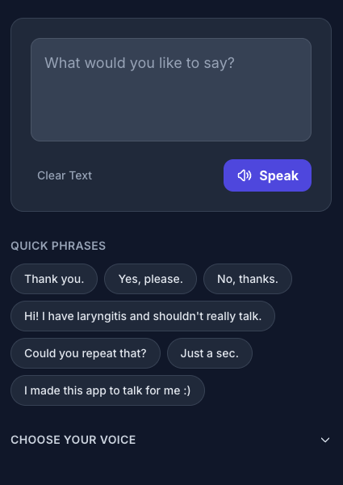

# VocalRest


A Next.js web application that helps you communicate when you can't use your voice. Type text and let AI speak for you using Google's Gemini Text-to-Speech API.

Perfect for situations like laryngitis, voice rest, or any time you need to communicate without speaking. I initially vibe-coded this quickly on Google AI Studio, then tweaked it a bit more. The voice is meant to sound vaguely like my own (not very well, but still), but you can choose lots of [other voices](https://ai.google.dev/gemini-api/docs/speech-generation#voices) or change the prompt as needed (different voices may need different prompting) to make it sound a bit more like you.




## Features

- **Text-to-Speech**: Convert typed text to natural-sounding speech using Gemini TTS
- **Multiple Voice Options**: Choose from 7 different voices (Orus, Umbriel, Algenib, Sadaltager, Charon, Fenrir, Puck) with varying tones and styles
- **Quick Phrases**: One-click buttons for common phrases like "Thank you", "Yes, please", "No, thanks", and more
- **Speech History**: View and replay your recent spoken phrases (last 30 items)
- **Audio Caching**: Automatically caches generated audio in IndexedDB for instant playback of repeated phrases
- **Dark Mode UI**: Modern, accessible dark theme interface
- **Keyboard Shortcuts**: Press Enter to speak (Shift+Enter for new line)

## Run Locally

**Prerequisites:** Node.js

1. Install dependencies:
   ```bash
   npm install
   ```

2. Create a `.env.local` file in the root directory and set your Gemini API key:
   ```
   GEMINI_API_KEY=your_gemini_api_key_here
   ```

3. Run the development server:
   ```bash
   npm run dev
   ```

4. Open [http://localhost:3000](http://localhost:3000) in your browser.

## Build for Production

```bash
npm run build
npm start
```

This will build the app and run it in production mode on [http://localhost:3000](http://localhost:3000). Use this to test the production build locally before deploying.

## Technology Stack

- **Next.js 15** - React framework
- **React 19** - UI library
- **TypeScript** - Type safety
- **Tailwind CSS** - Styling
- **Google Gemini API** - Text-to-speech generation
- **IndexedDB** - Client-side audio caching
- **Web Audio API** - Audio playback

## License

MIT
